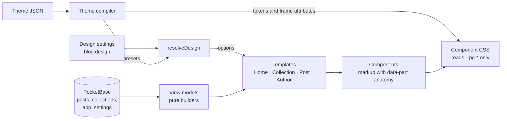
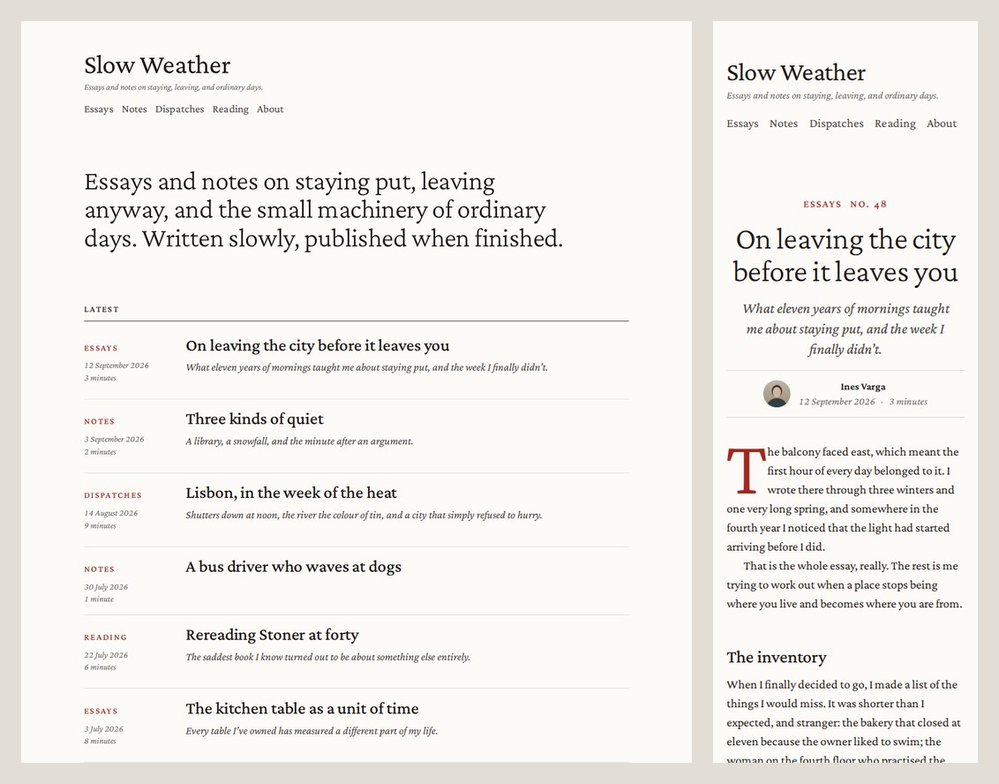
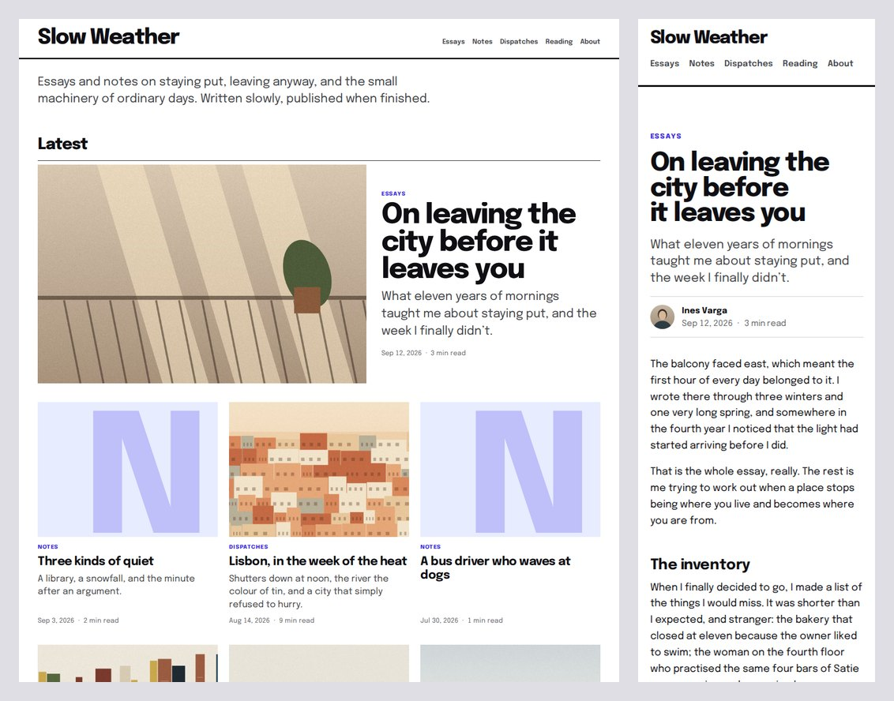
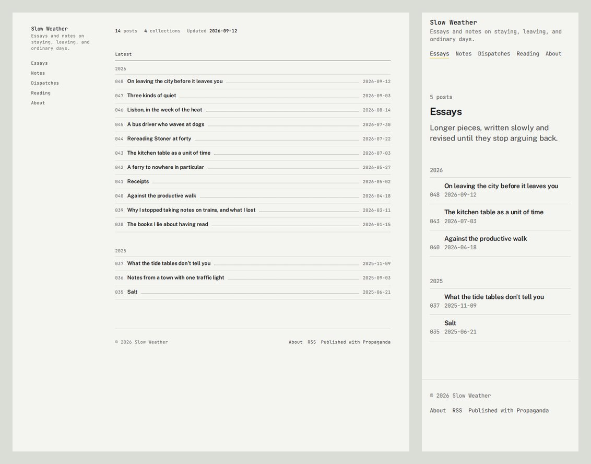
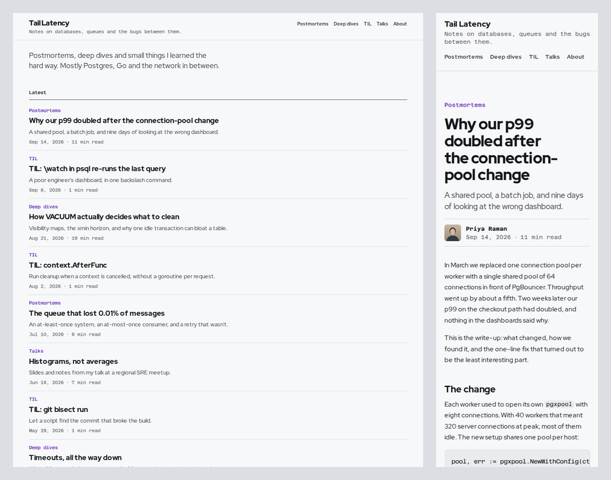
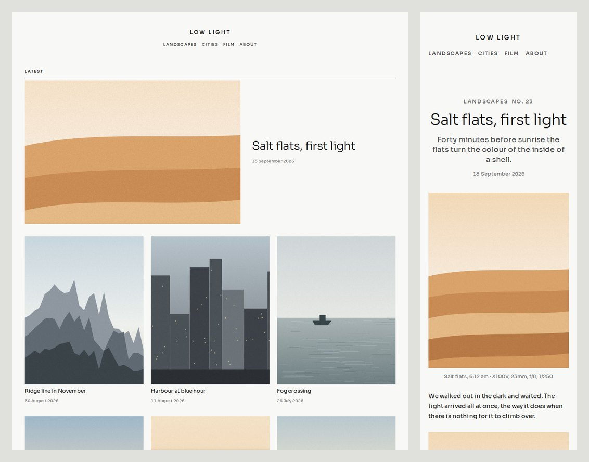
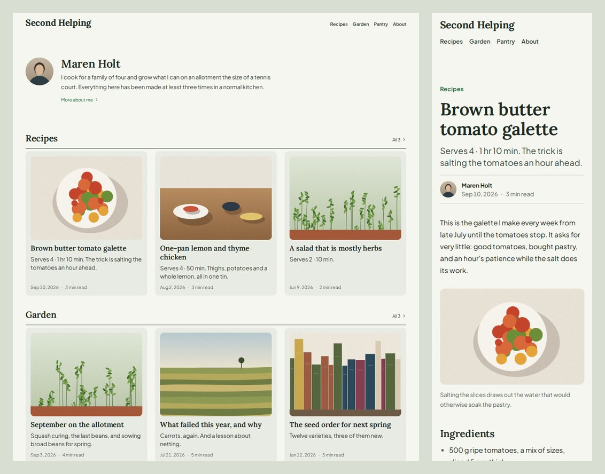

# Blog templates and themes, Part 1

Status: **proposal**, for decision. Nothing here is built into the app yet.
Tracking: Notion task "Blog templates and themes, Part 1" (Propaganda → Tasks).
Prototype: `prototype/dist/prototype.html` in this folder (open it in a browser; it is
self-contained), also published as a private artifact linked from the Notion task.

Part 1 covers the templates and six built-in themes. Custom themes (the Part 2 skill,
the uploaded theme file and the cloud check) are out of scope, but Part 1 has to leave
behind exactly what Part 2 needs: a theme format, a compiler, and a test harness.

---

## Summary

- **Four templates**: Home, Collection, Post, Author. Collection and Author pages are
  new routes (`/<collection>`, `/author`).
- **A contract between templates and themes.** Templates own markup, data,
  accessibility and behaviour. Themes own appearance, and only through a typed set of
  tokens plus a short list of layout variants the templates provide. A theme is a JSON
  file that a compiler validates, clamps and turns into CSS custom properties. It cannot
  add markup, and in Part 1 it cannot add CSS.
- **Page options** are enums and booleans only, so every combination is finite and
  testable. `PostsBunch` is rows or grid, and the choice decides which `PostCard`
  configurations are offered (Index, Summary, Feature for rows; Tile, Card, Cover for
  grid).
- **Six themes, each for an audience**: Rubric (essayists), Edition (publications),
  Ledger (public notebooks), Manual (engineers), Plate (photographers and designers),
  Almanac (cooks, gardeners, makers). They differ in type, colour and layout, and all six
  are pure data: zero theme-specific CSS. That is the evidence that the format goes deep
  enough.
- **Built to survive content**: container queries, intrinsic grids, titles that size
  down with length, fixed-ratio media with designed placeholders, truncation only in
  named places.
- **A conformance harness** renders every theme × template × content fixture × width ×
  a pairwise-covering set of option combinations, and checks invariants: no sideways
  scroll, nothing clipped or overlapping, WCAG contrast, tap targets, heading order and
  more. On the prototype, the six themes pass 22,032 renders across six content sets,
  and 24 randomly generated themes pass 88,128 renders, with no failures. Getting there, the harness and the fuzzer caught nine
  bugs that looking at screenshots had missed. Part 2's skill and cloud check run the
  same harness.
- **Fonts: open source only, and that is a legal requirement, not just a preference.**
  Fontshare's own licence for its signature fonts (ITF FFL v2.0, August 2026) forbids
  offering them as selectable fonts on a SaaS or template editor. Fontshare also hosts 36
  SIL OFL fonts. The six themes use nine of them. They are self-hosted and subset to
  Latin, at 93–167 KB of fonts per theme; italics load only when a page uses them.
- **No PocketBase schema change.** Design choices live in `app_settings`. One server
  hook change (reserving the `author` URL segment) needs your go-ahead.

---

## 1. Where the blog is today

`app/src/blog/` renders one design: `Home.tsx` (hero, collection tabs, rows of posts),
`Reader.tsx` (the post), and `styles.css` (a dozen colour and font variables scoped to
`.blog-app`). Per-site settings are `author.name/tagline/bio/location`, `site.manifesto`,
`site.title` and `favicon.url`.

What gets in the way of themes:

- **No collection or author pages.** Collections are tabs in local state (and
  localStorage), so a collection has no address to share.
- **Verbatim-specific details in shared code**: the drawn wordmark, the default
  manifesto, "Est. MMXXII", and a `mailto:hello@verbatim.example` link in every site's
  footer (`Colophon.tsx`).
- **Literal layout numbers**: the tab bar's `top: 56px` assumes the top bar is exactly
  56 px tall. Change the header and it breaks. Themes need every such number to come
  from a token, or not to exist.
- **Fonts**: Geist loads from Google Fonts, so every reader's browser calls a third party.
  Roslindale Display is a retail DJR face (check its licence before it serves anything
  beyond Verbatim).
- **List payloads**: the home page fetches every published post *with its full body*.
  This is fine at 317 posts and worth fixing later (see §15).

## 2. Goals and non-goals

Part 1 goals: the four templates; page options with an editor panel; six themes; the
theme format and compiler; the harness; moving Verbatim over with no visual regression.

Not in Part 1: custom themes, custom CSS, the skill, uploading or checking a theme file,
dark themes, comments, newsletters, search, server-side rendering. The templates are pure
functions of their data, so server rendering stays possible later.

## 3. Vocabulary

| Term | Meaning |
|---|---|
| **Template** | A page type with a fixed structure: Home, Collection, Post, Author. |
| **Section** | A slot in a template, filled by one component (Home's intro, its post list). |
| **Component** | A reusable block with a stable anatomy: `PostsBunch`, `PostCard`, `SiteHeader`… |
| **Part** | A named piece of a component's markup, `data-part="title"`. The styling contract. |
| **Option** | A typed choice on a section, made by the site owner (grid or rows, show numbers…). |
| **Theme** | A JSON file: tokens, frame choices and option presets. |
| **Token** | A CSS custom property the component CSS reads, `--pg-ink`, `--pg-step-3`. |
| **Frame** | The page-level layout variants a theme picks from: header `stacked`/`inline`/`rail`, footer `minimal`/`columns`, margin on/off. |
| **Preset** | A theme's default for an option. The site owner can override any of them. |
| **Design** | A site's saved choice: theme plus option overrides. |

## 4. Architecture



Who owns what:

| Templates (Propaganda) | Themes | Site owner |
|---|---|---|
| Markup, parts, heading levels, landmarks, alt text | Colour, type, space, shape tokens within ranges | Which theme |
| Data: what each page shows, fallbacks for missing fields | Frame: header, footer, margin variants | Option overrides per page |
| Responsiveness: container queries, grids, clamps | Option presets | Site name, tagline, manifesto, author details |
| Behaviour: links, pagination, redirects | Date, reading-time and number formats | |

**Cascade layers** fix the order regardless of selector weight:
`@layer pg.base, pg.components, pg.theme, pg.custom;`. Built-in themes set tokens only.
Part 2's custom CSS goes in `pg.custom`, may target only the published anatomy
(`[data-part]`, `[data-variant]`, `[data-card]`) with an allowlist of properties, and
has to pass the same harness.

**What "going deep" means.** Every axis a theme can move is a token or an enumerated
variant with a range. More depth means adding tokens and variants to the contract, and
cases to the harness. It never means letting a theme write layout CSS. The component CSS
reads 128 tokens and 42 named parts; the six themes set tokens and nothing else.

## 5. The four templates

Each template is a fixed list of sections. Optional sections (the intro, everything after
a post) can be switched off; none are reordered in Part 1, which keeps the combinations
finite.

### Home `/`

1. `SiteHeader`
2. `Intro`: Manifesto (large statement), Compact (one line), Author (photo, name, bio
   excerpt) or None; optional post and collection counts.
3. Posts: **Latest** (all collections), **By collection** (one shelf per collection,
   six posts each, with a link to its page) or **Tabs** (Verbatim's current behaviour:
   switch collection in place). Each uses `PostsBunch`.
4. `SiteFooter`

### Collection `/<collection slug>` (new)

1. `SiteHeader` (the current collection is marked in the nav)
2. `CollectionHeader`: Plain or Banner; description; post count; optional tabs to the
   other collections.
3. `PostsBunch` with the collection's posts.

A hidden collection keeps today's "private collection" page. All posts are loaded
already, so pagination is a client-side "Show more".

### Post `/<collection slug>/<post slug>`

1. `PostHeader`: left or centred; text width or wide; subtitle, byline, reading time and
   post number on or off.
2. `Prose`: the Markdown body. Options: drop cap; images at text width or wide.
3. After the post: author card, details (collection, words, date, address), previous and
   next (cards, links or none), "More from this collection" (none, 3 or 6, in the
   collection's own `PostsBunch` style).

Today's redirects stay: `/p/<slug>`, `post_redirects`, legacy `/@slug/` links.

### Author `/author` (new)

1. `AuthorHeader`: centred or side by side; photo; links.
2. Bio, rendered as prose.
3. `PostsBunch` of every post.

A site has one author today (the `author.*` settings). `/author/<handle>` can follow when
sites have several writers. That needs public member profiles; the multi-tenant rollout
notes already list them as a follow-up.

### System pages

Not found, private collection, empty blog and loading. They are styled by tokens only,
and the harness covers them like any other page.

### Data the templates need

No schema change:

- `posts.number` joins the public fields the blog reads. It already exists.
- A card's image is the first image in the post body, until there is a cover field.
- Two new settings keys: `author.avatar` (uploaded through `api/upload.ts` like the
  favicon) and `author.links` (a list of label and URL).
- Collection counts, reading time, year groups and title length classes are computed in
  the view models.

## 6. Components and their options

| Component | Parts | Theme picks | Site owner picks |
|---|---|---|---|
| `SiteHeader` | brand, tagline, nav | stacked / inline / rail, alignment, rule | tagline, sticky |
| `Intro` | statement, stats, avatar | type roles | manifesto / compact / author / none, counts |
| `PostsBunch` | group, group-label, list, empty | grid spacing, card look | layout, card, columns, lead, group by, numbers, subtitles, reading time, collection name, page size |
| `PostCard` | media, eyebrow, collection, number, title, dek, meta, date, read-time | every token | through `PostsBunch` |
| `CollectionHeader` | count, title, description, tabs | type roles | plain / banner, description, count, tabs |
| `PostHeader` | eyebrow, title, dek, byline, meta | margin layout | alignment, width, subtitle, byline, reading time, number |
| `Prose` | (Markdown blocks) | paragraph style, ornament, links, quotes | drop cap, image width |
| After the post | author-card, details, post-nav, more | | each on or off, nav style, how many more |
| `AuthorHeader` | avatar, title, tagline, meta, links | | centred / side by side, photo, links |
| `SiteFooter` | name, collections, powered | minimal / columns | "Published with Propaganda" |

### PostsBunch and PostCard

The layout decides which card configurations exist. Each configuration is a named set of
parts, so there are six tested layouts rather than a free mix of booleans:

| Layout | Card | Shows | For |
|---|---|---|---|
| Rows | **Index** | number · title · dotted leader · date, on one line | archives, notebooks, long lists |
| Rows | **Summary** | collection, title, subtitle, date, reading time | essays |
| Rows | **Feature** | Summary plus a thumbnail when the post has an image | mixed blogs |
| Grid | **Tile** | collection, title, subtitle, meta on a tinted panel | text-only blogs that want a grid |
| Grid | **Card** | image or placeholder, collection, title, subtitle, meta | magazines |
| Grid | **Cover** | tall image or placeholder, title, date | photo collections |

On top of the card: columns (grid: auto, 2 or 3; auto fits as many as the width allows),
feature the newest post (it spans the row), group by year (rows), post numbers,
subtitles, reading time, collection name (auto shows it only when a list mixes
collections), and posts per page (6, 12, 24, all).

When an option doesn't apply it is hidden, not ignored: grid has no "group by year", and
Index and Cover have no subtitles. Switching layout picks that layout's default card, so a
saved design is never an impossible pair.

## 7. Where the design is stored, and how it resolves

- **Storage**: two `app_settings` keys per site, `blog.design` (published) and
  `blog.design.draft` (being edited). `app_settings` is already per site, readable by the
  public blog, realtime, and holds up to 200 KB of JSON. There is no migration.
- **Shape** (sparse, only what the owner changed):
  ```json
  { "v": 1, "theme": "edition", "themeVersion": "1.0.0",
    "options": { "home": { "feed": { "layout": "rows", "card": "summary" } } },
    "collections": { "photographs": { "posts": { "layout": "grid", "card": "cover" } } } }
  ```
- **Resolution**, field by field: schema defaults ← theme presets ← site overrides ←
  per-collection overrides. An unknown key or value is dropped. The editor warns; the
  blog never errors.
- **Switching theme** keeps what the owner chose explicitly. Everything else follows the
  new theme's presets.
- **Per-collection overrides** (a Photographs collection as a Cover grid, Essays as
  Summary rows) are in the data shape from day one. Their editor UI can come after.

## 8. Theme API v1

### The format

A theme is JSON. Rubric, abridged (the full files are in `prototype/engine.js`):

```json
{
  "api": 1, "id": "rubric", "name": "Rubric", "version": "1.0.0",
  "fonts": { "display": "Crimson Pro", "text": "Crimson Pro", "ui": "Crimson Pro", "mono": "system" },
  "color": { "paper": "#FCFBF8", "ink": "#1D1814", "accent": "#A8261B" },
  "type": {
    "text": { "size": [18, 21], "leading": 1.55 }, "scale": [1.2, 1.25], "figures": "oldstyle",
    "display": { "weight": 300, "leading": 1.06, "tracking": -0.012 },
    "dek": { "style": "italic" },
    "label": { "case": "upper", "tracking": 0.14, "color": "accent" },
    "meta": { "style": "italic" },
    "roles": { "postTitle": 5, "collTitle": 5, "cardTitle": 2, "manifesto": 4 }
  },
  "layout": { "container": 1040, "measure": 60, "margin": 168, "header": "stacked", "footer": "minimal" },
  "prose": { "paragraph": "indent", "ornament": "¶", "quote": "accent", "link": "underline" },
  "format": { "date": "long", "readTime": "long", "number": "No. {n}" },
  "presets": { "home": { "intro": { "variant": "manifesto" } } }
}
```

### What the compiler does

1. **Validates and clamps** every field against its type and range (Appendix A). An
   out-of-range value is clamped and reported. An unknown font is an error.
2. **Derives the palette from three inputs**, with guarantees on every background text
   can sit on (paper, the tinted surface, the image placeholder):
   - ink ≥ 7:1 on paper (it is darkened if not);
   - secondary text ≥ 8:1; muted text and accent text ≥ 4.6:1;
   - an accent that can't meet that (a highlighter yellow) stays decorative, and a
     readable accent text colour is derived from it;
   - the text-selection highlight keeps ink at ≥ 7:1.
3. **Builds a fluid type scale** from two base sizes and two ratios (phone, desktop):
   steps −2 to 6, in `rem` so browser text zoom works, never below 12 px. Themes assign
   steps to roles (post title = step 5) instead of setting pixel sizes, so the hierarchy
   can't invert.
4. **Checks glyph coverage**: ornaments and interface characters must exist in the theme's
   fonts. The prototype found that ⁂ and ❦ exist in none of the first four fonts, and arrows
   are missing from Crimson Pro and Public Sans. So ornaments come from a checked list,
   and arrows in the templates are SVG icons.
5. **Outputs** about 120 custom properties on `.pg-site[data-theme=…]`, plus four frame
   attributes: `data-theme`, `data-header`, `data-footer`, `data-margin`.

In the app, the compiler runs at build time for built-in themes. Part 2 runs it on upload
and inside the skill.

## 9. Robustness rules

These are the rules the components follow. Each one exists because some content or some
theme would otherwise break the page; several came out of the harness.

1. **Size to the container, not the viewport.** `PostsBunch`, cards, the header and the
   placeholder are CSS containers. A card that is narrow in a three-column grid behaves
   like a card on a phone.
2. **Intrinsic grids**:
   `repeat(auto-fill, minmax(min(100%, max(var(--pg-grid-min), (100% - gaps) / cols)), 1fr))`.
   A grid never overflows and never exceeds the chosen column count.
3. **Every text part** has `min-width: 0` and `overflow-wrap: anywhere` (titles, names,
   URLs), with `text-wrap: balance` on headings.
4. **Content-aware sizes.** The view model marks long and very long titles, names and
   manifestos (`data-len`), and they step down. A 220-character title gets a smaller
   headline instead of 19 lines of display type.
5. **Truncation only in named parts**: card subtitles (2–4 lines), grid card titles (5
   lines), labels hung in a margin (one line, ellipsis). The full text stays in the page
   for screen readers. The harness fails any other clipped text.
6. **Media in fixed-ratio boxes** with `object-fit: cover`. A missing or broken image
   becomes a designed placeholder in the same box: a tinted panel with the collection's
   initial set huge and cropped. Images in posts are capped at 85% of the screen height
   and never scaled up.
7. **Atomic values**: a date or a reading time never breaks across lines.
8. **Mixed scripts**: `dir="auto"` on titles, subtitles and prose blocks, logical
   properties throughout, and font stacks that end in system fonts. Arabic and Japanese
   titles render correctly in a Latin-only theme.
9. **One sticky element at a time**, and no `position: fixed` inside templates. Overlays
   render outside the site root, so they can't collide with a theme's header height.
10. **Icons are drawn** (SVG in `currentColor`), not typed.
11. **Post bodies lay out on a grid** with text, wide and full tracks. Wide images break
    out of the text column cleanly. Margins don't collapse inside a grid, so vertical
    rhythm uses top margins only; a doubled gap around section breaks was the bug that
    taught this.
12. **Tables and code scroll** inside their own box. Table rows stay on one line, instead
    of an off-screen column squeezing every row tall.
13. **Tap targets are at least 24 px** (WCAG 2.2 AA), text is at least 12 px, and focus
    rings use the accent text colour.
14. **Headings follow the outline.** Year labels and card titles take their level from
    the section they sit in.
15. **`prefers-reduced-motion`** turns off transitions.

## 10. The six themes

Screenshots are in `screens/`. The prototype shows all four templates in each theme, at
three widths, with each theme's own kind of blog plus the edge-case and empty blogs.

### Who each theme is for

The themes are split by subject, not by taste. A writer should recognise their own kind
of blog in the list before they look at a single colour.

| Theme | For | What their posts are like | What the theme optimises |
|---|---|---|---|
| Rubric | Essayists, memoirists, critics, fiction writers | Long, finished prose; few images | Reading comfort, book conventions |
| Edition | Small magazines, newsletters, multi-writer publications | Many posts, images, several sections | A front page, hierarchy, images |
| Ledger | Working notes, reading logs, research journals, digital gardens | Frequent short entries; the list is the product | Scanning a long archive |
| Manual | Engineers, technical writers | Code blocks, tables, inline identifiers, headings; few images | Code legibility, wide blocks, scannable structure |
| Plate | Photographers, illustrators, architects, designers | The image is the post; text is a caption | Getting out of the images' way |
| Almanac | Cooks, gardeners, makers, travel guides | Practical how-tos: photos, ingredient lists, numbered steps | Warmth, lists, browsing by subject |

Each theme is shown with its own sample blog in the prototype (Essays, Engineering,
Photography, Kitchen & garden). Picking a theme switches to its sample, and the edge-case
and empty blogs apply to every theme.

### Rubric: book typography



- **Type**: Crimson Pro for everything. Headlines are weight 300 and body text 400, with
  italics for subtitles and dates and old-style figures. Text is 18–21 px.
- **Colour**: paper `#FCFBF8`, ink `#1D1814` (17:1), rubric red `#A8261B` (6.9:1). The
  red is used only for labels, the drop cap, the section mark and link underlines.
- **Layout**: the header is stacked and left-aligned. A 168 px margin holds each post's
  collection and date beside its title, like marginalia. Post headers are centred.
- **Signature details**: indented paragraphs with no space between them, a three-line red
  drop cap, a red pilcrow (¶) as the section break, italic dates set as "12 September
  2026".
- **Defaults**: home shows the manifesto and Summary rows. Collections use a Banner header
  and rows grouped by year. Posts have a centred header, drop cap and author card. The
  author page is centred, with Index rows.

### Edition: a modern magazine



- **Type**: Epilogue. Headlines are weight 800 with tight tracking (−0.035em), titles 700
  and text 400. Labels use the font's true small caps. Text is 17–19 px on a steep scale
  (1.333 on desktop).
- **Colour**: white paper, ink `#0E0E13` (19:1), ultramarine `#3525E6` (8.2:1) for labels,
  links and the current nav item.
- **Layout**: an inline masthead over a 3 px rule and a columns footer. Post headers and
  images go wide.
- **Signature details**: an image-led grid with the newest story spanning the row.
  Section heads are set in the display face. A post without an image gets a pale
  ultramarine panel with a huge cropped initial, so the grid still reads as designed.
- **Defaults**: home is a three-column Card grid with a lead story. Collections are the
  same, with tabs to the other collections. Posts have a wide header, wide images and
  three "more from" cards. The author page is side by side, with Tiles.

### Ledger: a notebook



- **Type**: Public Sans for text and titles. JetBrains Mono for the site name, nav,
  labels, dates, numbers and code. Text is 16–17 px on a gentle scale (1.2).
- **Colour**: paper `#F4F4F0`, ink `#1C1D1F` (15:1), highlighter `#E9CF2B`. The
  highlighter is 1.4:1, so the compiler keeps it decorative (link marks, the current nav
  item, selection) and derives `#706733` (5.2:1) for accent text.
- **Layout**: a sticky left rail from 1024 px, becoming a top bar below that.
- **Signature details**: numbered entries (`048`) with dotted leaders to ISO dates
  (`2026-09-12`), grouped by year. Links are highlighter-marked, images are shown in
  greyscale, a § marks section breaks, and each post ends with a details table.
- **Defaults**: Index rows everywhere, with numbers. Posts have a left header, the details
  table and previous/next links.

### Manual: technical writing



- **For**: engineers writing postmortems, deep dives and "today I learned" notes.
- **Type**: Red Hat Display for text and headings (crisp, open, made for screens). Azeret
  Mono for code, labels and dates; it is wide enough that `rn` never reads as `m`. Text
  is 16–18 px.
- **Colour**: cool paper `#F7F8FA`, ink `#13161B` (17:1), violet `#6D28D9` (6.7:1) for
  links, labels and the current nav item.
- **Layout**: an inline, sticky header, so navigation stays reachable in long posts.
  There's a columns footer, and a 72-character text column.
- **Code**: code blocks sit on a framed panel and use the wide track, because code lines
  run longer than prose lines. Ligatures are always off, so `fi` in an identifier stays
  two letters (the specimen caught Azeret rendering `NewWithConfig` as `NewWithConfıg`).
- **Defaults**:
  - Home is Summary rows with reading time.
  - Collections have tabs to their siblings and rows grouped by year.
  - Posts end with a details table, previous/next cards and three more from the
    collection.

### Plate: a portfolio



- **For**: photographers, illustrators, architects and designers.
- **Type**: Sora throughout. Headlines are weight 300, the site name is set in tracked
  capitals, and the type is small (15–17 px) so it steps back.
- **Colour**: near-white `#F8F8F6`, ink `#111111`, a warm grey-brown `#6B5C47` that
  never competes with a photograph.
- **Layout**: a centred, stacked header and a 1320 px container. Images are 4:5 portrait
  tiles, images go wide in posts, and tall images are capped at the screen height.
- **Defaults**:
  - Home and collections are Cover grids, with no subtitles or reading times.
  - Posts have a centred title and the post number, and captions carry the camera
    details.

### Almanac: practical and warm



- **For**: cooks, gardeners, makers and travel writers.
- **Type**: Lora headings (a friendly calligraphic serif) over Plus Jakarta Sans text,
  which stays legible in ingredient lists and numbered steps. Text is 17–18 px with
  generous leading.
- **Colour**: pale sage paper `#F4F6EF`, ink `#1E2A22`, leaf green `#276B40`.
- **Layout**: rounded surface cards (14 px), rounded images and a columns footer.
- **Defaults**:
  - Home opens with the author, then one shelf per collection (Recipes, Garden, Pantry).
  - Collections are Card grids with a lead.
  - Posts have wide images, an author card and three more from the collection.

### What the new audiences added to the contract

- **A code token group** (`prose.code`: panel, rule or plain, plus code size), and code
  that never uses ligatures.
- **"Images and code: wide"** as one post option, since both outgrow the text column.
- **Letter-spacing ranges that depend on case.** Tracked capitals need up to 0.25em;
  lowercase text never does.
- **An `audience` field on themes**, shown on the theme cards in the editor.

Two components these audiences will want are not in Part 1: a table of contents with
heading anchors (Manual), and a structured recipe block with servings and times
(Almanac, which would also give search engines recipe data). Both fit the contract as new
sections with their own options.

## 11. Fonts and licences

**The finding.** The ITF Free Font License, version 2.0 (17 August 2026), covers
Fontshare's best-known fonts: Satoshi, General Sans, Clash, Cabinet Grotesk, Switzer,
Zodiak, Sentient, Gambetta, Erode, Boska and others. Its section 02 says:

> You may not host, serve, embed or otherwise make the Font Software available for use by
> third parties through any website, application, online service, SaaS platform, design
> tool, template editor or similar service. This includes making the Font Software
> available as a selectable font for third-party users to create, edit, customize or
> generate their own content…

That is exactly what a Propaganda theme is. The same licence also forbids subsetting and
format conversion. So FFL fonts can't be offered in any built-in theme, and they
shouldn't be accepted in Part 2 uploads either, without a separate licence from ITF.

**What is allowed.** Fontshare's catalogue lists 64 FFL and 36 SIL OFL fonts. OFL allows
use, modification (subsetting), bundling and redistribution, as long as the font isn't
sold on its own and the licence travels with it. None of the nine chosen fonts declares
a Reserved Font Name, so subsets don't need renaming.

| Font | Role | Latin subset (variable, woff2) |
|---|---|---|
| Crimson Pro | Rubric: everything | roman 58 KB, italic 61 KB |
| Epilogue | Edition: everything | roman 52 KB, italic 55 KB |
| Public Sans | Ledger: text and titles | roman 29 KB, italic 32 KB |
| JetBrains Mono | Ledger: interface and code | roman 43 KB |
| Red Hat Display | Manual: text and headings | roman 42 KB, italic 44 KB |
| Azeret Mono | Manual: code, labels, dates | roman 38 KB |
| Sora | Plate: everything | roman 48 KB, italic 45 KB |
| Lora | Almanac: headings | roman 41 KB, italic 46 KB |
| Plus Jakarta Sans | Almanac: text and interface | roman 38 KB, italic 42 KB |

Per theme, that is 119 KB for Rubric, 107 KB for Edition, 104 KB for Ledger, 124 KB for
Manual, 93 KB for Plate and 167 KB for Almanac (all four of its files). An italic
downloads only when a page uses it, so a typical page loads less.

**How they ship.**

- **Self-hosted** on the app's own origin (Vercel), under `/fonts/<family>/`. That means
  no third provider, no reader request to Fontshare or Google, and it works if Fontshare's
  API disappears.
- **Split by `unicode-range`** (Latin, Latin Extended, and more later), the way Google
  Fonts does it, so a page downloads only the scripts it uses.
- **Fallback metrics.** Each face gets a local fallback with `size-adjust` and
  `ascent-override` computed at build time, so text doesn't jump when the font arrives.
- **Licence notices.** The OFL text ships next to the files, and the font files keep their
  copyright and licence name fields (`pyftsubset --name-IDs='*'`).

## 12. The conformance harness

`prototype/harness.js` is a Node script using Playwright. It is the same code Part 2's
skill runs locally and the cloud check runs on upload.

**Fixtures** (`prototype/fixtures.js`):

- **Four audience samples**:
  - **Essays**: four collections, fourteen posts, images, footnotes and a quote.
  - **Engineering**: postmortems and deep dives with Go and SQL code, a results table,
    inline identifiers and few images.
  - **Photography**: every post is a picture with a caption.
  - **Kitchen & garden**: recipes with ingredient lists and numbered steps.
- **Edge**: built to break layouts.
  - Content: a 100-character site name, a 600-character manifesto and 12 collections
    (one empty, one with a single post, emoji, Arabic and Japanese names).
  - Titles: a 220-character title, a 90-character word, a bare URL as a title, emoji-only
    and empty titles, and Arabic and Japanese titles.
  - Missing and extreme values: missing dates, zero words, 250,000 words, a five-digit
    post number.
  - Images: 2×2 px, 1:4 and 5:1 ratios, and a broken URL.
  - Body: an 8-column table, a long code line, nested lists and quotes, an `h1` inside the
    body, and 64 posts in total.
- **Empty**: a new blog with nothing published.

**Matrix**: 6 themes × 4 templates × 6 fixtures × 6 widths (320, 390, 768, 1023, 1024,
1440; 1023 and 1024 straddle the rail breakpoint). Each is crossed with the theme's own
defaults plus a pairwise-covering set of option combinations, so every pair of option
values appears together at least once: 31 option sets for Home, 30 for Collection, 12
for Post and 29 for Author. In total that is 22,032 renders, in about three minutes on
four browser pages.

**Checks**, on every render:

| Check | Rule |
|---|---|
| `h-overflow` | the page never scrolls sideways |
| `escapes-viewport` | no element sits outside the viewport, unless a clipping box hides it |
| `clipped-text` | no text is cut off, except in the named truncating parts |
| `overlap` | no two parts of a card, header or byline overlap |
| `contrast` | WCAG 2.x text contrast: 4.5:1, or 3:1 for large text, on the real background |
| `tap-target` | navigation-type links and buttons are at least 24 × 24 px |
| `min-font` | no text below 12 px |
| `headings` | one `h1`; no skipped levels |
| `landmarks` | header, nav, main and footer are present |
| `img-alt`, `img-broken` | every image has alt text; a broken image has been replaced |
| `empty-part` | no empty boxes |
| `measure` | prose lines hold 45–80 characters from 768 px, 30–80 on phones (paragraphs with inline code are skipped: monospace identifiers wrap early by nature) |
| `invalid-option` | no stored option was silently dropped |

**What it caught** while the prototype was being built (all fixed):

Found by the harness:

- Muted text passed on white but fell to 4.08:1 on the tinted tile background. The
  compiler now guarantees contrast on every surface text can sit on.
- Year labels and, in Tabs mode, card titles skipped a heading level.
- A one-letter collection name ("Q") made an 8 px-wide nav link; footer and section links
  were under 24 px.
- Footnote markers rendered at 10–11 px, and Ledger's tab counts at 11.7 px.
- An 88-character collection name overflowed the page at 768 px in Rubric. The first fix
  failed: `max-width: min(28ch, 100%)` is ignored while a link measures its content, so
  the link kept the full width.

Found by fuzzing (random themes, next section):

- Measure was set in CSS `ch`, the width of "0", which is not font-independent. Crimson
  Pro's average character is 0.68 of its "0", so Rubric's "60ch" column held about 88
  characters. The compiler now measures in each font's real average character width,
  plus slack for line breaking.
- A monospace body font at a large size left 23 characters per line on a 320 px phone.
  The compiler now caps the phone text size by font width.
- Scaling a long title down could take a small headline below 12 px, and inline code
  fell to 11.8 px once the phone cap applied. Both now have size floors.

Found by looking at renders, before the harness existed: dates wrapping mid-date,
collection names breaking mid-word in a narrow margin, a 220-character lead title
rendered as 19 lines, a 1:4 portrait image four screens tall, table rows squeezed tall by
an off-screen column, a doubled gap around section breaks (grid margins don't collapse),
arrows and ↩ falling back to other fonts, and a rule overhanging its list.

The harness had bugs of its own, fixed on the way. It first treated clipped decorative
letters as overflow, assumed the nav was always a scroller, and waited forever on lazy
images below the fold.

### Fuzzing: themes nobody designed

The built-in themes were designed alongside the templates, so their passing proves
less than it seems. `prototype/fuzz.js` generates random themes across the whole Theme
API: any font in any role, random colours (including unreadable ones), sizes, weights,
tracking, frames, radii, rule styles, prose styles and formats, with about one value in
eight deliberately out of range.

- **Compiler**: 2,000 random themes. None broke a colour guarantee, none produced an
  invalid value, and the compiler never threw. It repaired about 2,900 values, clamped
  about 6,300 and rejected 143 (dark paper, unknown ornaments).
- **Rendering**: 24 random themes through the full matrix and all six content sets,
  88,128 renders, no failures.
  Many of these themes are ugly, but none of them breaks a page.

This is the check Part 2 needs. The cloud validator runs the same compiler and harness on
an uploaded theme, and a theme that fails doesn't go live.

**In CI** (proposed): a GitHub Action would run the harness on every change to
`app/src/blog/**`, against the React templates, before merge.

## 13. The editor: a Design panel

A Design panel in site settings (owners only). The prototype's left column is a working
sketch of it:

- **Theme**: three cards, each showing its name in its own typeface with its colours.
- **Page options**: tabs for Home, Collection, Post, Author and Site-wide. Controls are
  generated from the options schema, so a new option needs no new UI code. A dot marks a
  choice that differs from the theme's default, with a reset for each section.
- **Live preview**: the real blog templates in an iframe, at phone, tablet or desktop
  width, showing your posts, the sample blog, or the edge cases.
- **Draft, then publish**: edits go to `blog.design.draft`, and "Publish design" copies
  them to `blog.design`. Readers never see a half-made design, even though settings update
  live.
- **Author settings** gain a photo and links.

## 14. Plan

Each phase ships on its own, and a site looks exactly as it does today until its owner
publishes a design.

1. **Contract and engine.**
   - Build the component CSS, the React components and view models, `resolveDesign`, and
     the theme compiler as a build step, in `app/src/blog/`.
   - Port today's Verbatim look as a private `verbatim` theme (Roslindale, the drawn
     wordmark), with no visual change.
   - Add the harness to CI.
   - This is the real test of the contract: if the current design can't be expressed as
     tokens and variants, the contract is wrong.
2. **Routes.** Collection and author pages, and the reserved segment (needs your
   go-ahead, see §15). Fix the shared-code Verbatim leftovers (footer email, "Est.").
3. **The six themes**, with the font pipeline (subsetting, `unicode-range`, fallback
   metrics).
4. **The Design panel**, with draft and publish and the live preview. Add the author photo
   and links.
5. **Verbatim's choice.** Keep the private theme or move to one of the six (§16).

## 15. Server and data changes

| Change | Kind | Needs your go-ahead |
|---|---|---|
| Reserve `author` as a first path segment in `pb/pb_hooks/lib/addresses.js` and `app/src/lib/slug.ts`, after a read-only check that no collection already has that slug | hook change, deployed by Bedrock CI | **yes** |
| Read `posts.number` on the public blog | app only | no |
| New settings keys `blog.design`, `blog.design.draft`, `author.avatar`, `author.links` | written by owners from the editor; no migration | no (and nothing is ever written to a real site automatically) |
| Later: a cover field on posts, and list queries without `content_md` | schema change | yes, and not part of Part 1 |

Consider reserving the other segments future pages will want (`feed`, `rss`, `search`,
`tags`) in the same change. Each later reservation risks colliding with a collection
someone has named by then.

## 16. Decisions for you

1. **Verbatim's look.** Port it as a private theme (recommended: zero visual change, and
   the best test of the contract), or move Verbatim to Rubric, Edition or Ledger.
2. **The author page address.** `/author` (recommended: it leaves room for
   `/author/<handle>`) or `/about`.
3. **Home tabs.** Keep Verbatim's in-place tabs as the Tabs option (recommended), or make
   tabs plain links to collection pages.
4. **Per-collection overrides.** Recommended: the data shape now, the editor UI after the
   main panel.
5. **Your message was cut off** after "and then a component called". I assumed you meant
   the collection header, with its tabs to the other collections. Say if you meant
   something else (pagination? a subscribe block?).
6. **Theme names and line-up**: Rubric, Edition, Ledger, Manual, Plate, Almanac. Launch
   with all six, or with three and add the rest later. Names are easy to change now and harder once
   sites use them.

---

## Appendix A. Theme API v1 reference

| Group | Field | Values | Range or options |
|---|---|---|---|
| fonts | display, text, ui, mono | a library family | Crimson Pro, Epilogue, Public Sans, JetBrains Mono, system |
| color | paper, ink, accent, highlight? | hex | paper must be light; ink is darkened to 7:1 if needed |
| type.text | size [phone, desktop] | px | 15–19, 16–22 |
| type.text | leading | number | 1.4–1.8 |
| type | scale [phone, desktop] | ratio | 1.1–1.25, 1.125–1.414 |
| type | figures | enum | oldstyle, lining |
| type.display | weight, leading, tracking | | 200–900, 0.95–1.3, −0.05–0.02 em |
| type.title | weight, font, tracking | | 300–900, display/text/ui |
| type.dek | font, style | | display/text/ui, normal/italic |
| type.brand | font, weight, style, case, tracking | | |
| type.label | font, case, tracking, weight, color, step | | case: upper/smallcaps/none; color: accent/muted/ink; tracking 0–0.2 em |
| type.meta, type.nav | font, style, case, step | | step −1–1 |
| type.section | font | display or label | |
| type.roles | brand, manifesto, postTitle, collTitle, cardTitle, indexTitle, leadTitle, dek, section | scale step | each role has its own allowed steps |
| space | unit, density, row | | 3–8 px, 0.8–1.3 |
| shape | radius, imageRadius, avatar, rule, ruleWidth, leader, headerRule, footerRule, card | | radius 0–16; rule solid/dotted/dashed; leader none/dotted/rule; edges none/thin/strong/thick; card plain/surface/outline |
| layout | container, measure, margin, wide, rail, gridMin | | 880–1400 px, 52–78 ch, 0–220 px, 180–300 px, 200–360 px |
| layout | header, headerAlign, footer | enum | stacked/inline/rail, start/center, minimal/columns |
| layout | imageRatio, coverRatio, leadRatio | ratio | |
| prose | paragraph, ornament, quote, quoteItalic, link, caption | enum | space/indent; ¶ § * * * · · · — rule; accent/strong/none; underline/accent/marker |
| images | filter | enum | none, soft, mono |
| format | date, readTime, number | enum or pattern | long/medium/iso; long/short/min; `No. {n}`, `#{n}`, `{n:03}` |
| presets | per template, per section | option values | validated against the options schema |

## Appendix B. Files

| Path | What |
|---|---|
| `prototype/site.css` | The component CSS: the stylesheet the React templates would use |
| `prototype/engine.js` | The theme compiler, the six themes, the options schema, view models, components and templates |
| `prototype/fixtures.js` | Essays, engineering, photography and kitchen blogs, plus edge and empty blogs; images are painted on a canvas |
| `prototype/shell.html` | The prototype's control panel |
| `prototype/harness.js` | The conformance harness |
| `prototype/fuzz.js` | Random themes for the compiler and the harness |
| `prototype/build.py` | Builds `dist/prototype.html` (the self-contained prototype) and `dist/embed.html` (the harness entry) |
| `prototype/fonts/` | The OFL font subsets and their licences |
| `screens/` | Screenshots used above |
